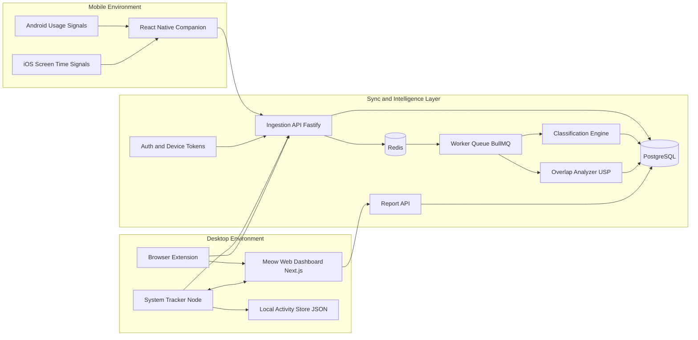
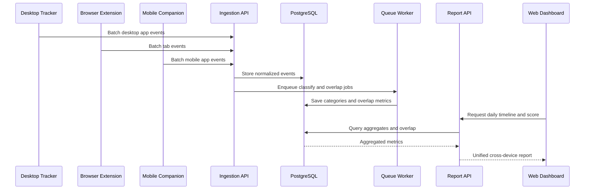

# Meow Cross-Device Architecture and Integration

## 1. Goal

This document explains how Meow can evolve from a local desktop tracker into a cross-device attention intelligence platform.

Target outcome:
- Track productive activity on desktop (for example coding in VS Code).
- Track distractive activity on phone (for example Instagram Reels or YouTube Shorts).
- Merge both timelines into one truth source.
- Compute overlap-based signals that reveal hidden distraction.

This is designed to integrate with the current Meow codebase with minimum rewrite.

---

## 2. Existing Meow Components (Already Present)

Current components and responsibilities:

1. Desktop System Tracker (Node)
- Captures active window app/title.
- Exposes local WebSocket endpoint on localhost.
- Persists sessions locally.

2. Browser Extension
- Captures domain-level browsing sessions and duration.
- Syncs session events into the desktop data pipeline.

3. Web Dashboard (Next.js)
- Visualizes live sessions and reports.
- Uses categorization logic for Productive, Distracting, Neutral.

4. Electron Shell
- Desktop packaging option for app delivery.

These remain part of the new architecture.

---

## 3. Proposed Tech Stack (Integrated with Existing)

### 3.1 Core language strategy

- TypeScript end-to-end wherever possible.
- Keep event schema consistent across desktop, extension, web, mobile, and backend.

### 3.2 Frontend and client surfaces

- Existing: Next.js web dashboard.
- Existing: Browser extension (Manifest v3 JavaScript/TypeScript style).
- Existing: Node sidecar tracker.
- New: React Native mobile companion app.
  - Android native bridge: Kotlin module for app usage signals.
  - iOS native bridge: Swift module with best-effort Screen Time style signals.

### 3.3 Backend and APIs

- Node.js API service (Fastify preferred for lightweight performance).
- Optional WebSocket channel for realtime multi-device dashboard updates.
- REST endpoints for event ingestion, device registration, and report reads.

### 3.4 Data and processing

- PostgreSQL as primary event store.
- Prisma ORM for schema management and typed queries.
- Redis + BullMQ for async pipelines:
  - classification
  - aggregation
  - overlap detection
  - daily score jobs

### 3.5 Auth and identity

- Supabase Auth (fast MVP) or NextAuth/Auth.js (custom control).
- Account has multiple devices.
- Each device has a signed device token.

### 3.6 Observability and deployment

- Docker for local and production parity.
- Deploy API on Fly.io/Render/Railway for MVP.
- Sentry for runtime error tracking.

---

## 4. Integration Principle

The integration should be additive, not disruptive:

- Keep current local-first mode working exactly as now.
- Add a sync mode that can be enabled per user.
- When sync is off, no cloud write happens.
- When sync is on, local tracker and extension also emit normalized events to API.

This gives Meow two modes:
- Local-only privacy mode.
- Cross-device sync mode.

---

## 5. Unified Event Model

Use one normalized event contract for all sources.

```json
{
  "eventId": "uuid",
  "userId": "uuid",
  "deviceId": "uuid",
  "source": "desktop-app|desktop-tab|mobile-app",
  "name": "code.exe|youtube.com|instagram",
  "title": "window title or screen context",
  "category": "productive|distracting|neutral|unknown",
  "startedAt": "2026-03-31T09:10:00.000Z",
  "endedAt": "2026-03-31T09:22:00.000Z",
  "durationSec": 720,
  "confidence": 0.93,
  "metadata": {
    "platform": "windows|android|ios|browser",
    "appPackage": "com.instagram.android",
    "domain": "youtube.com"
  }
}
```

Why this matters:
- Current desktop and browser pipelines can map into this model quickly.
- Mobile data lands in the same shape.
- Reporting code can aggregate without source-specific branches.

---

## 6. End-to-End Working (How Everything Connects)

### Step 1: Data capture

- Desktop sidecar captures active app windows.
- Extension captures domain sessions.
- Mobile app captures foreground app usage windows.

### Step 2: Local normalization

- Each client converts raw signals into normalized event payloads.
- Each event is stamped with userId, deviceId, source, timestamps.

### Step 3: Sync and ingestion

- Clients push events in batches to ingest API.
- API validates token, deduplicates eventId, stores raw events.

### Step 4: Classification and enrichment

- Worker classifies unknown activity by rule sets.
- Shared categorization package applies productive/distracting rules.
- Confidence score is attached.

### Step 5: Overlap analysis (USP layer)

- Engine finds intervals where:
  - desktop activity is productive, and
  - mobile activity is distracting, and
  - time windows overlap.

- Produces signals like:
  - split-focus minutes
  - deep-work interruptions
  - distraction bursts

### Step 6: Reporting

- Dashboard fetches aggregated daily and weekly metrics.
- Timeline view shows device source overlays.
- User sees hidden distraction while coding, not just total screen time.

---

## 7. Mermaid Architecture Diagram



Reading tip:
- Left side is data producers.
- Middle is cloud sync and analytics.
- Rightmost dashboard path is insight consumption.

---

## 8. Mermaid Sequence Diagram (Single Session Flow)



---

## 9. Focus and Distraction Scoring

Recommended metrics:

1. Productive Minutes
- Sum of productive intervals across desktop and browser.

2. Distractive Minutes
- Sum of distractive intervals across all devices.

3. Overlap Distractive Minutes (Key USP)
- Distractive mobile minutes that overlap productive desktop windows.

4. Focus Purity
- Formula: 1 - (Overlap Distractive Minutes / Productive Desktop Minutes)
- If no productive desktop minutes, set to 0 to avoid division instability.

5. Deep Work Interruptions
- Count of overlap bursts longer than N seconds.

---

## 10. Privacy Model

Support two explicit modes:

1. Local-Only Mode
- Existing behavior.
- No cloud sync.

2. Sync Mode
- Cross-device aggregation enabled.
- Encrypted transport (HTTPS/TLS).
- Per-device revocable tokens.
- Optional redaction rules for sensitive titles.

This maintains trust while enabling the new USP.

---

## 11. Platform Constraints and Practical Scope

- Android: richer app-level tracking is practical with user-granted permissions.
- iOS: stricter privacy controls; implement best-effort signals and clear user communication.

Recommendation:
- Launch full cross-device beta with Android first.
- Add iOS with transparent capability boundaries.

---

## 12. Migration Plan from Current Codebase

Phase 1:
- Extract shared categorization logic into a reusable package.
- Add normalized event contract in tracker and extension.

Phase 2:
- Build ingestion API + database schema.
- Add optional sync toggle in dashboard settings.

Phase 3:
- Release Android companion and device linking.
- Implement overlap analyzer and new report cards.

Phase 4:
- Harden privacy controls, retries, offline buffering, observability.
- Expand iOS capabilities where allowed.

---

## 13. Why This Becomes a Real USP for Meow

Most trackers answer "How long did you use device X?"

Meow can answer "When you were doing productive work, what distracted you from another device at the same time?"

That difference is strategic because it measures attention fragmentation, not just screen time.
